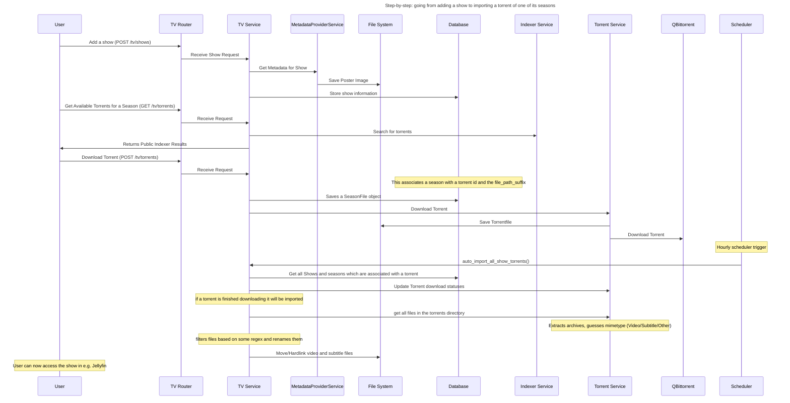

# Developer Guide

This section is for those who want to contribute to Media Manager or understand its internals.

## Source Code directory structure

- `media_manager/`: Backend FastAPI application
- `web/`: Frontend SvelteKit application
- `Writerside/`: Documentation
- `metadata_relay/`: Metadata relay service, also FastAPI

## Special Dev Configuration

### Environment Variables

MediaManager uses various environment variables for configuration. In the Docker development setup (
`docker-compose.dev.yaml`), most of these are automatically configured for you.

#### Backend Variables

- `BASE_PATH`: Sets the base path for the app (e.g., for subdirectory deployments)
- `PUBLIC_VERSION`: Version string displayed in `/api/v1/health` endpoint
- `FRONTEND_FILES_DIR`: Directory for built frontend files (e.g., `/app/web/build` in Docker)
- `MEDIAMANAGER_MISC__DEVELOPMENT`: When set to `TRUE`, enables FastAPI hot-reloading in Docker

#### Frontend Variables

- `PUBLIC_API_URL`: API URL for backend communication (automatically configured via Vite proxy in Docker)
- `PUBLIC_VERSION`: Version string displayed in the frontend UI
- `BASE_PATH`: Base path for frontend routing (matches backend BASE_PATH)

#### Docker Development Variables

- `DISABLE_FRONTEND_MOUNT`: When `TRUE`, disables mounting built frontend files (allows separate frontend container)

<tip>
    This is automatically set in <code>docker-compose.dev.yaml</code> to enable the separate frontend development container
</tip>

#### Configuration Files

- Backend: `res/config/config.toml` (created from `config.dev.toml`)
- Frontend: `web/.env` (created from `.env.example`)

## Contributing

- Consider opening an issue to discuss changes before starting work

## Setting up the Development Environment

I use IntellijIdea with the Pycharm and Webstorm plugins to develop this, but this guide should also work with VSCode.
Normally I'd recommend Intellij, but unfortunately only Intellij Ultimate has support for FastAPI and some other
features.

### Recommended VSCode Plugins:

- Python
- Svelte for VSCode
- and probably more, but I don't use VSCode myself, so I can't recommend anymore.

### Recommended Intellij/Pycharm Plugins:

- Python
- Svelte
- Pydantic
- Ruff
- VirtualKit
- Writerside (for writing documentation)

### Recommended Development Workflow

The **recommended way** to develop MediaManager is using the fully Dockerized setup with `docker-compose.dev.yaml`.
This ensures you're working in the same environment as production and makes it easy for new contributors to get started
without installing Python, Node.js, or other dependencies locally.

The development environment includes:

- **Backend (FastAPI)** with automatic hot-reloading for Python code changes
- **Frontend (SvelteKit/Vite)** with Hot Module Replacement (HMR) for instant updates
- **Database (PostgreSQL)** pre-configured and ready to use

#### What supports hot reloading and what does not

- Python code changes (.py files), Frontend code changes (.svelte, .ts, .css) and configuration changes (config.toml)
  reload automatically.
- Changing the backend dependencies (pyproject.toml) requires rebuilding:
  `docker compose -f docker-compose.dev.yaml build mediamanager`
- Changing the frontend dependencies (package.json) requires restarting the frontend container:
  `docker compose -f docker-compose.dev.yaml restart frontend`
- Database migrations: Automatically run on backend container startup

This approach eliminates the need for container restarts during normal development and provides the best developer
experience with instant feedback for code changes.

#### How the Frontend Connects to the Backend

In the Docker development setup, the frontend and backend communicate through Vite's proxy configuration:

- **Frontend runs on**: `http://localhost:5173` (exposed from Docker)
- **Backend runs on**: `http://mediamanager:8000` (Docker internal network)
- **Vite proxy**: Automatically forwards all `/api/*` requests from frontend to backend

This means when your browser makes a request to `http://localhost:5173/api/v1/tv/shows`, Vite automatically proxies it
to `http://mediamanager:8000/api/v1/tv/shows`. The `PUBLIC_API_URL` environment variable is set to use this proxy, so
you don't need to configure anything manually.

### Setting up the full development environment with Docker (Recommended)

This is the easiest and recommended way to get started. Everything runs in Docker with hot-reloading enabled.

1. Copy the example config & .env:
   ```bash
   cp config.dev.toml res/config/config.toml
   cp web/.env.example web/.env
   ```

2. Start all services:
   ```bash
   # Recommended: Use make commands for easy development
   make up

   # Alternative: Use docker compose directly (if make is not available)
   docker compose -f docker-compose.dev.yaml up
   ```

   <tip> Run <code>make help</code> to see all available development commands including <code>make down</code>, <code>make logs</code>, <code>make app</code> (
   shell into backend), and more.</tip>

3. Access the application:
    - Frontend (with HMR): http://localhost:5173
    - Backend API: http://localhost:8000
    - Database: localhost:5432

That's it! Now you can edit code and see changes instantly:

- Edit Python files → Backend auto-reloads
- Edit Svelte/TypeScript files → Frontend HMR updates in browser
- Edit config.toml → Changes apply immediately

### Setting up the backend development environment (Local)

1. Clone the repository
2. cd into repo root
3. [Install `uv`.](https://docs.astral.sh/uv/getting-started/installation/)
4. run `uv --version` to verify that `uv` is installed correctly
5. Install python if you haven't already:
    ```bash
    uv python install 3.13
    ```
6. Create a virtual environment with uv
    ```bash
    uv venv --python 3.13
    ```

7. Install dependencies:
    ```bash
    uv sync
    ```

8. run db migrations with
    ```bash
      uv run alembic upgrade head
   ```

9. run the backend with
    ```bash
    uv run fastapi run media_manager/main.py --reload --port 8000
    ```

- format code with `uv run ruff format .`
- lint code with `uv run ruff check .`

### Setting up the frontend development environment (Local, Optional)

<note>
Using the Docker setup above is recommended. This section is for those who prefer to run the frontend locally outside of Docker.
</note>

1. Clone the repository
2. cd into repo root
3. cd into `web` directory
4. Install Node.js and npm if you haven't already, I
   used [nvm-windows](https://github.com/coreybutler/nvm-windows?tab=readme-ov-file):
    ```powershell
    nvm install 24.1.0
    nvm use 24.1.0
    ```
   I also needed to run the following command to be able to use `npm`:
   ```powershell
   Set-ExecutionPolicy -ExecutionPolicy RemoteSigned -Scope CurrentUser
   ```
5. Create a `.env` file in the `web` directory:
   ```bash
   cp .env.example .env
   ```
   Update `PUBLIC_API_URL` if your backend is not at `http://localhost:8000`

6. Install the dependencies with npm: `npm install`
7. Start the frontend development server: `npm run dev`

<tip>If running frontend locally, make sure to add <code>http://localhost:5173</code> to the <code>cors_urls</code> in your backend
config file.</tip>

- Format the code with `npm run format`
- Lint the code with `npm run lint`

## Troubleshooting

### Common Docker Development Issues

#### Port already in use errors

- Check if ports 5173, 8000, or 5432 are already in use: `lsof -i :5173` (macOS/Linux) or
  `netstat -ano | findstr :5173` (Windows)
- Stop conflicting services or change ports in `docker-compose.dev.yaml`

#### Container not showing code changes

- Verify volume mounts are correct in `docker-compose.dev.yaml`
- For backend: Ensure `./media_manager:/app/media_manager` is mounted
- For frontend: Ensure `./web:/app` is mounted
- On Windows: Check that file watching is enabled in Docker Desktop settings

#### Frontend changes not updating

- Check that the frontend container is running: `make ps` or `docker compose -f docker-compose.dev.yaml ps`
- Verify Vite's file watching is working (should see HMR updates in browser console)
- Try restarting the frontend container: `docker compose -f docker-compose.dev.yaml restart frontend`

#### Backend changes not reloading

- Verify `MEDIAMANAGER_MISC__DEVELOPMENT=TRUE` is set in `docker-compose.dev.yaml`
- Check backend logs: `make logs ARGS="--follow mediamanager"` or
  `docker compose -f docker-compose.dev.yaml logs -f mediamanager`
- If dependencies changed, rebuild: `docker compose -f docker-compose.dev.yaml build mediamanager`

#### Database migration issues

- Migrations run automatically on container startup
- To run manually: `make app` then `uv run alembic upgrade head`
- To create new migration: `make app` then `uv run alembic revision --autogenerate -m "description"`

#### Viewing logs

- All services: `make logs`
- Follow logs in real-time: `make logs ARGS="--follow"`
- Specific service: `make logs ARGS="mediamanager --follow"`

#### Interactive debugging

- Shell into backend: `make app` (or `docker compose -f docker-compose.dev.yaml exec -it mediamanager bash`)
- Shell into frontend: `make frontend` (or `docker compose -f docker-compose.dev.yaml exec -it frontend sh`)
- Once inside, you can run commands like `uv run alembic upgrade head`, `npm install`, etc.

#### Volume permission issues (Linux)

- Docker containers may create files as root, causing permission issues
- Solution: Run containers with your user ID or use Docker's `user:` directive
- Alternatively: `sudo chown -R $USER:$USER .` to reclaim ownership

#### Complete reset

If all else fails, you can completely reset your development environment:

```bash
make down
docker compose -f docker-compose.dev.yaml down -v  # Remove volumes
docker compose -f docker-compose.dev.yaml build --no-cache  # Rebuild without cache
make up
```

## Sequence Diagrams



## Tech Stack

### Backend

- Python
- FastAPI
- SQLAlchemy
- Pydantic and Pydantic-Settings
- Alembic

### Frontend

- TypeScript
- SvelteKit
- Tailwind CSS
- shadcn-svelte
- openapi-ts
- openapi-fetch

### CI/CD

- GitHub Actions
